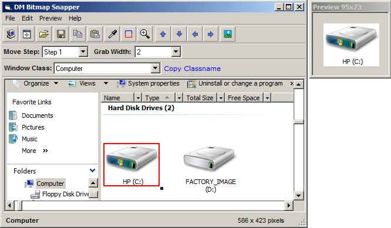



## DM Bitmap Snapper v1\.4 Update

### Description

New update v1.4 to my Bitmap snapper tool, Now supports resizeing of the form, no more will you have to depend on the scrollbars, the grabber tool is also now resizeable, paste picture from clipboard added, Edit image in default image editor added, Some new GUI updates and code fixes. Update to Help file. anyway I hope you all enjoy the update. any comments sugestions are very welcome.
 
### More Info
 

             |
---                |---
**Submitted On**   |2008-09-21 00:12:34
**By**             |[dreamvb](https://github.com/Planet-Source-Code/PSCIndex/blob/master/ByAuthor/dreamvb.md)
**Level**          |Beginner
**User Rating**    |4.9 (34 globes from 7 users)
**Compatibility**  |VB 6\.0
**Category**       |[Complete Applications](https://github.com/Planet-Source-Code/PSCIndex/blob/master/ByCategory/complete-applications__1-27.md)
**World**          |[Visual Basic](https://github.com/Planet-Source-Code/PSCIndex/blob/master/ByWorld/visual-basic.md)
**Archive File**   |[DM\_Bitmap\_2127749212008\.zip](https://github.com/Planet-Source-Code/dreamvb-dm-bitmap-snapper-v1-4-update__1-70969/archive/master.zip)

